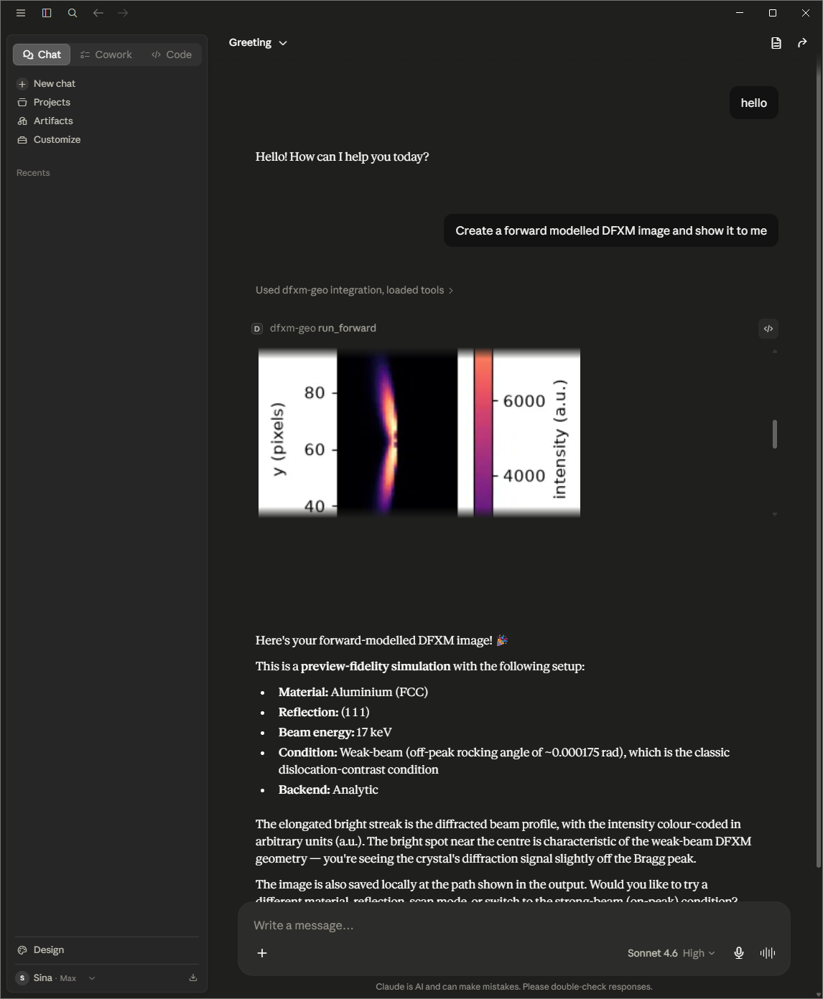

# dfxm-geo-mcp

An MCP server that lets an AI client drive the [dfxm-geo](https://github.com/borgi-s/Geometrical_Optics_master) dark-field X-ray microscopy forward model: validate and scaffold configs, enumerate reachable reflections, and render preview-scale simulations.

## Run

    uvx dfxm-geo-mcp

Claude Desktop (`claude_desktop_config.json`):

    {"mcpServers": {"dfxm-geo": {"command": "uvx", "args": ["dfxm-geo-mcp"]}}}

Or: `pip install dfxm-geo-mcp` then `dfxm-geo-mcp`.

> First run pulls a heavy scientific stack (numba/scipy) and warms a JIT cache (~10 s once). No fake demo mode — the sims are real.

## Tools

validate_config · find_reflections · predict_visibility (g·b reflection-visibility ranking; structured scores plus a self-contained `.html`) · scaffold_config · run_forward (analytic preview; saves a PNG **and** a self-contained `.html`) · run_rocking (interactive φ-rocking-curve viewer: a single self-contained `.html` with a frame scrubber + live rocking-curve plot) · start_bootstrap / get_job_status / get_job_result (MC fidelity).

Both `run_forward` and `run_rocking` write self-contained HTML (image(s) embedded, all CSS/JS inline, no external origins) that opens full-size in any browser and is surfaced by file-showing clients.

## Architecture

A protocol-agnostic ops layer wrapping dfxm-geo, under a thin FastMCP adapter. See `docs/superpowers/specs/`.

## Roadmap (v2)

run_identify · remote HTTP transport · `.mcpb` bundle.

<!-- mcp-name: io.github.borgi-s/dfxm-geo-mcp -->
